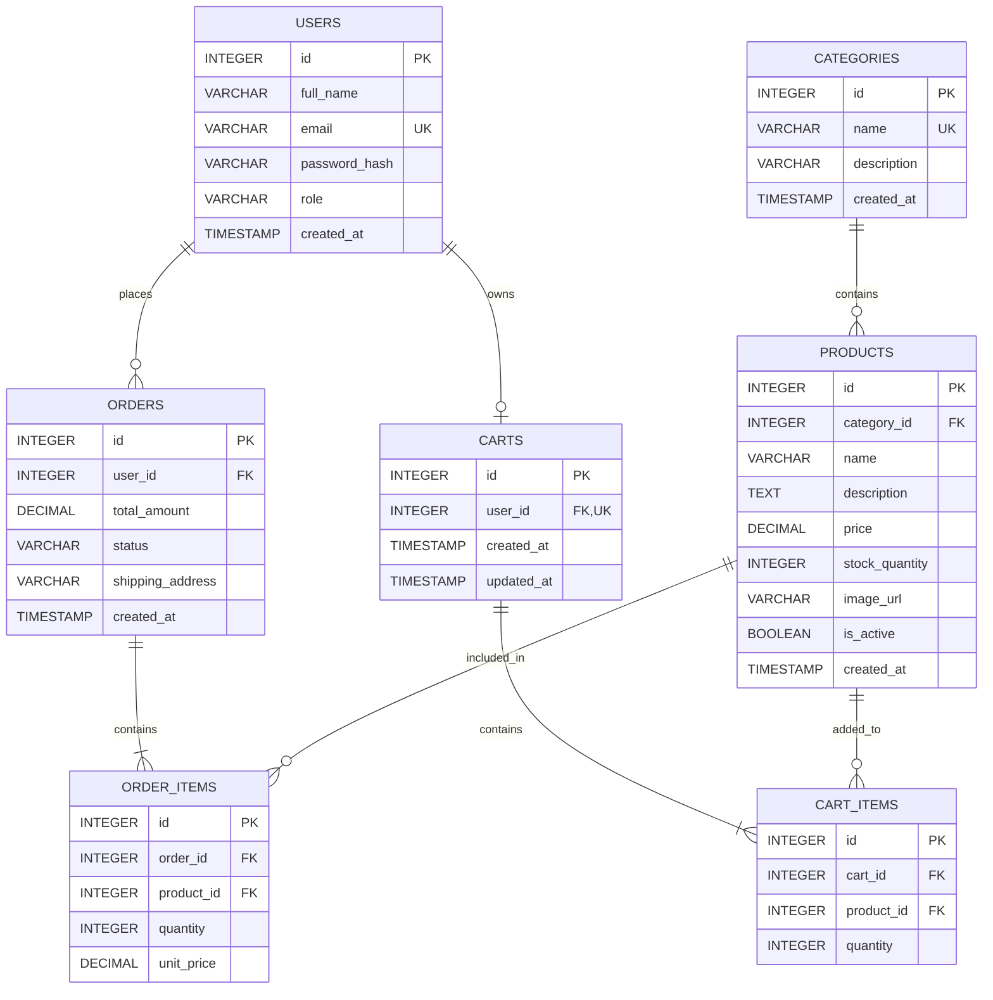

# E-Commerce SDLC — Sprint 1
## Architecture & Scope Definition

**Student Name:** Faisal Rustmani  
**Roll Number:** 2K23/CSM/37  
**Repository:** `ecommerce-2K23-CSM-37`  
**Document:** `docs/SPRINT_1.md`

---

## 1. Target Audience & Market Focus

### Primary Persona

The primary users of this e-commerce platform are **young adults and general online shoppers in Pakistan**, especially university students and working customers who prefer to search for products, compare prices, and place orders online.

**Example Persona:**  
A university student who regularly purchases everyday products such as clothing, accessories, stationery, mobile accessories, and other small consumer goods. The user mainly accesses the platform through a mobile phone and expects a simple, fast, and reliable shopping experience.

### Core Problem

Many small and medium-sized sellers still depend on social media pages, messaging applications, or manual order records to manage online sales. This can make product discovery, stock management, cart handling, order placement, and order tracking difficult for both customers and sellers.

The proposed e-commerce system provides a centralized platform where customers can browse products, manage their cart, place orders, and receive basic order information, while administrators can manage products, categories, and inventory from one system.

### Market Focus / Domain Scope

**Market Vertical:** General Consumer E-Commerce

The initial MVP will focus on **consumer products**, including:

- Clothing and fashion accessories
- Mobile and electronic accessories
- Stationery and everyday items
- Small household products

The scope is intentionally limited to common consumer products so that the MVP remains practical to develop and test within the academic semester.

---

## 2. Minimum Viable Product (MVP) Feature Scope

The MVP focuses on the core customer shopping workflow and the minimum administrative functionality required to operate the platform.

| Category | Feature | Description | Priority |
|---|---|---|---|
| Authentication | User Registration & Login | Allows customers and administrators to create accounts and securely sign in. Passwords will be stored using secure hashing. | High (MVP) |
| Catalog | Product List & Search | Allows users to browse products, search by name, and filter products by category. | High (MVP) |
| Product | Product Details | Displays product name, description, price, available stock, category, and other basic product information. | High (MVP) |
| Cart | Cart Management | Allows users to add products to the cart, change quantities, remove items, and view the current cart total. | High (MVP) |
| Checkout | Order Processing | Converts the cart into an order and stores order items, quantities, prices, and order status. A mock payment flow may be used for the academic MVP. | High (MVP) |
| Admin | Inventory & Product Control | Allows administrators to create, update, delete, and manage products, categories, prices, and stock quantities. | Medium (MVP) |

### MVP Boundary

The first sprint defines only the core architecture and scope. Advanced features such as product reviews, discount coupons, recommendation systems, live delivery tracking, advanced analytics, and a full production payment gateway are outside the initial MVP and can be considered for future sprints if time permits.

---

## 3. Tech Stack Selection & Justification

### Frontend Framework: React.js

**Justification:**  
React.js is selected because it supports reusable UI components and is well suited to interactive e-commerce interfaces such as product listings, search, carts, and checkout pages. Compared with building the frontend with plain JavaScript, React provides better component organization and makes the application easier to maintain as the project grows.

### Backend Infrastructure: Node.js with Express.js

**Justification:**  
Node.js with Express.js provides a lightweight and widely used backend architecture for REST APIs. It works well with JavaScript-based frontend development, has a large ecosystem, and is sufficient for the expected workload of an academic e-commerce project without the complexity of a heavier enterprise framework.

### Database Management System: PostgreSQL

**Justification:**  
PostgreSQL is selected because the e-commerce domain contains strongly related entities such as users, products, categories, orders, and order items. Its relational structure, foreign-key constraints, transactions, and data integrity features make it more appropriate for this normalized schema than a document-oriented database such as MongoDB.

### Caching: Redis (Optional)

**Justification:**  
Redis can be introduced as an optional caching layer for frequently accessed data such as product/category information or temporary session-related data. It is not required for the basic MVP, but it provides a clear path for improving performance if the application grows.

### Proposed Architecture

The system will follow a **three-layer architecture**:

1. **Presentation Layer:** React.js frontend
2. **Application/API Layer:** Node.js + Express.js REST API
3. **Data Layer:** PostgreSQL database

The frontend communicates with the backend through REST API endpoints. The backend handles authentication, business logic, validation, order processing, and database operations.

---

## 4. Entity-Relationship Diagram (ERD)

The database is designed as a relational model with explicit primary keys, foreign keys, SQL-compatible data types, and defined cardinalities.

### Entity Overview

- **Users:** Stores customer and administrator accounts.
- **Categories:** Stores product categories.
- **Products:** Stores product information and links each product to a category.
- **Orders:** Stores customer orders and their status.
- **Order_Items:** Associative entity connecting orders with products.
- **Carts:** Stores the active cart associated with a user.
- **Cart_Items:** Associative entity connecting carts with products.

### Mermaid ERD

### Relationship & Cardinality Explanation

| Relationship | Cardinality | Explanation |
|---|---|---|
| Users → Orders | 1:N | One user can place many orders, while each order belongs to one user. |
| Users → Carts | 1:1 | One user has one active cart, while each cart belongs to one user. |
| Categories → Products | 1:N | One category can contain many products, while each product belongs to one category. |
| Orders → Order_Items | 1:N | One order contains one or more order items. |
| Products → Order_Items | 1:N | One product can appear in many order items across different orders. |
| Carts → Cart_Items | 1:N | One cart can contain multiple cart items. |
| Products → Cart_Items | 1:N | One product can be present in many users' carts. |

### N:M Relationships Resolved Through Associative Entities

Two many-to-many relationships are represented using associative entities:

- **Orders ↔ Products:** resolved through `ORDER_ITEMS`.
- **Carts ↔ Products:** resolved through `CART_ITEMS`.

This structure avoids storing multiple product IDs in a single database field and keeps the relational model normalized.

### Key Constraints

- `USERS.id`, `CATEGORIES.id`, `PRODUCTS.id`, `ORDERS.id`, `ORDER_ITEMS.id`, `CARTS.id`, and `CART_ITEMS.id` are primary keys.
- `PRODUCTS.category_id` references `CATEGORIES.id`.
- `ORDERS.user_id` references `USERS.id`.
- `ORDER_ITEMS.order_id` references `ORDERS.id`.
- `ORDER_ITEMS.product_id` references `PRODUCTS.id`.
- `CARTS.user_id` references `USERS.id`.
- `CART_ITEMS.cart_id` references `CARTS.id`.
- `CART_ITEMS.product_id` references `PRODUCTS.id`.
- User email and category name are unique.
- A user can have only one active cart.
- Quantities must be positive integers.
- Product prices and order totals use `DECIMAL` to avoid inappropriate floating-point representation for monetary values.

---

## Sprint 1 Summary

Sprint 1 establishes a feasible architecture and defines the minimum functional boundary of the e-commerce application. The selected React.js, Node.js/Express.js, PostgreSQL, and optional Redis stack provides a practical foundation for implementation in later SDLC sprints.

The ERD covers the required core entities and explicitly defines primary keys, foreign keys, SQL-compatible data types, and relationship cardinalities. The MVP is intentionally limited to authentication, product discovery, product details, cart management, checkout/order processing, and basic administration so that the system can be developed and tested within the academic semester.
